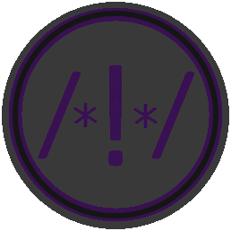

#  Even Better Comments

The Even Better Comments extension is based on the [Better Comments extension](https://marketplace.visualstudio.com/items?itemName=aaron-bond.better-comments) which will help you create more human-friendly comments in your code.

**Even Better Comments** seeks to improve upon this framework by adding in aliases, documentation, default values, token parsing, commands, and other various improvements.

With this extension, you will be able to categorise your annotations into:
* Issues
* Ideas
* Dividers
* TODOs
* Highlights
* Commented out code can also be styled to make it clear the code shouldn't be there
* Any other comment styles you'd like can be specified in the settings


## Configuration

This extension can be configured in User Settings or Workspace settings.
`evenbettercomments.enabled : true`
This setting will enable or disable the entire extension.
When false, the entire extension will be disabled. (WIP)

`"evenbettercomments.monolineComments": true`  
This setting will control whether monoline comments are styled using the annotation tags.
When false, monoline comments will be presented without decoration.

`"evenbettercomments.multilineComments": true`  
This setting will control whether multiline comments are styled using the annotation tags.
When false, multiline comments will be presented without decoration.

`"evenbettercomments.highlightPlainText": false`  
This setting will control whether comments in a plain text file are styled using the annotation tags.
When true, the tags (defaults: `! * ? //`) will be detected if they're the first non-whitespace character on a line.

`"evenbettercomments.highlightTagOnly": false`  
This setting will control if any matching tags will have just the tag, or the entire line highlighted.
When true, only the actual tag will be highlighted instead of the entire line.

`"evenbettercomments.allowFullBlockHighlights": false`  
This setting will tell the parser whether it should check for a tag at the beginning of a block comment for a style.
When true, if a tag is found at the start of a block comment, the entire block comment will be decorated with its style.


`evenbettercomments.tags`  
The tags are the characters or sequences used to mark a comment for decoration.
The default 5 can be modified to change the styles, and more can be added.

```json
"evenbettercomments.tags": [
	{
		"tag": "!",
		"aliases": ["Issue", "problem"],
		"color": "#FF2D00",
		"overline": false,
		"strikethrough": false,
		"underline": false,
		"backgroundColor": "transparent",
		"bold": false,
		"italic": false
	}, {
		"tag": "?",
		"aliases": ["Idea", "Info"],
		"color": "#3498DB",
		"overline": false,
		"strikethrough": false,
		"underline": false,
		"backgroundColor": "transparent",
		"bold": false,
		"italic": false
	}, {
		"tag": "//",
		"aliases": ["-----"],
		"color": "#474747",
		"overline": false,
		"strikethrough": true,
		"underline": false,
		"backgroundColor": "transparent",
		"bold": false,
		"italic": false
	}, {
		"tag": "TODO",
		"color": "#FF8C00",
		"overline": false,
		"strikethrough": false,
		"underline": false,
		"backgroundColor": "transparent",
		"bold": false,
		"italic": false
	}, {
		"tag": "*",
		"aliases": ["Important", "Wip", "~~~~~"],
		"color": "#98C379",
		"overline": false,
		"strikethrough": false,
		"underline": false,
		"backgroundColor": "transparent",
		"bold": false,
		"italic": false
	}
]
```

## Supported Languages

* Ada
* AL
* Ansible
* Apex
* AsciiDoc
* BrightScript
* C
* C#
* C++
* ColdFusion
* Clojure
* COBOL
* CoffeeScript
* CSS
* Dart
* Dockerfile
* Elixir
* Elm
* Erlang
* F#
* Fortran
* Gdscript
* GenStat
* Gleam
* Go
* GraphQL
* Groovy
* Haskell
* Haxe
* HiveQL
* HTML
* Java
* JavaScript
* JavaScript React
* JSON with comments
* Julia
* Kotlin
* LaTeX (inlc. Bibtex/Biblatex)
* Less
* Lisp
* Lua
* Makefile
* Markdown
* Nim
* MATLAB
* Objective-C
* Objective-C++
* ObjectPascal
* Pascal
* Perl
* Perl 6
* PHP
* Pig
* PlantUML
* PL/SQL
* PowerShell
* Puppet
* Python
* R
* Racket
* Ruby
* Rust
* SAS
* Sass
* Scala
* SCSS
* ShaderLab
* ShellScript
* SQL
* STATA
* Stylus
* Svelte
* Swift
* Tcl
* Terraform
* Twig
* TypeScript
* TypeScript React
* Verilog
* Visual Basic
* Vue.js
* XML
* YAML

And more! Most languages which are properly configured should be supported.